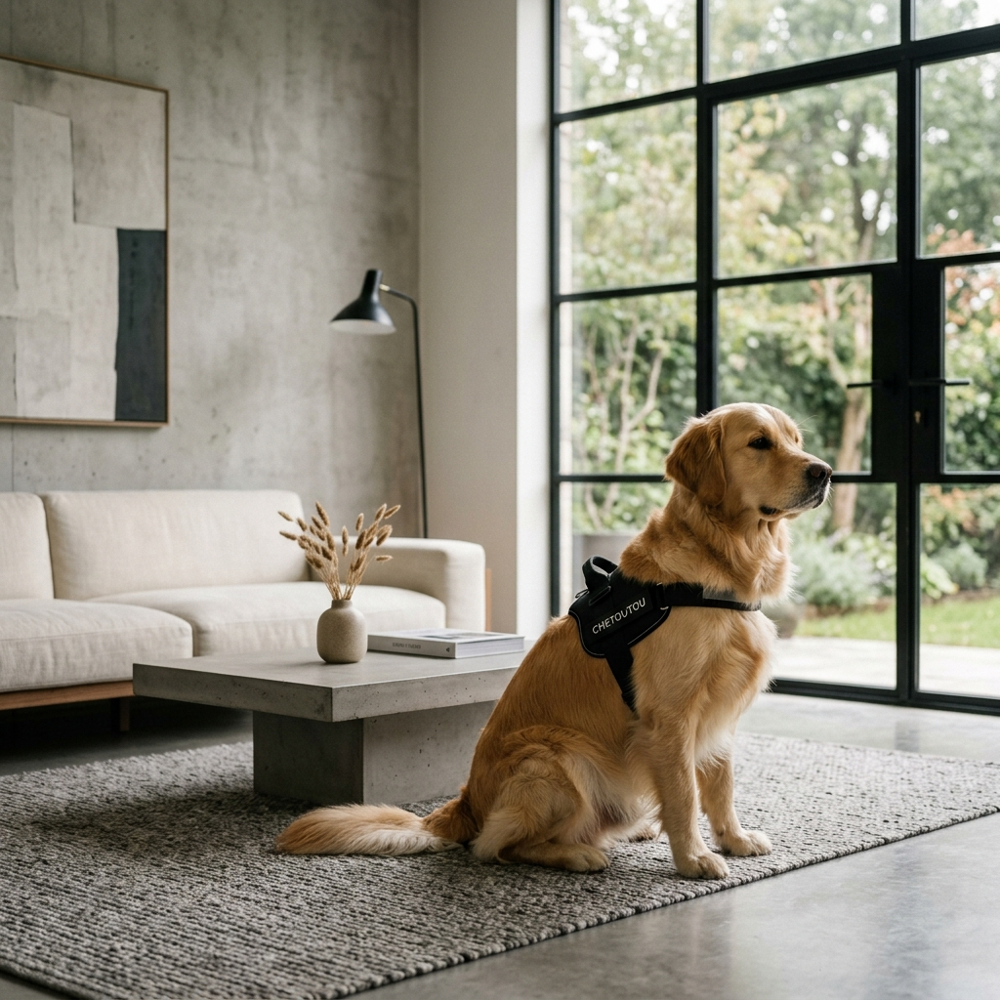

# Chetoutou Boutique 🐾

Une boutique en ligne premium au design "Luxe Minimaliste" et éditorial, conçue pour l'excellence et le bien-être canin.

## 🎨 Philosophie de Design
Le site adopte une esthétique **Luxe Minimaliste** inspirée des magazines de mode et de design industriel.
- **Typographie** : Helvetica Neue / Inter pour une clarté maximale.
- **Palette** : Tons beige sable (#F5E6D3), blanc cassé et le bleu signature Chetoutou (#334e5c).
- **Mise en page** : Grilles aérées, typographie forte et imagerie éditoriale.

## ✨ Fonctionnalités
- **Navigation Avancée** : Megamenu visuel et interactif.
- **Expérience Utilisateur** : Superpositions de recherche et de panier ultra-fluides (glassmorphism).
- **Responsive Design** : Optimisé pour tous les appareils (Mobile-First).
- **Gestion Facilitée** : Script `sync_layout.py` permettant de synchroniser l'en-tête et le pied de page sur plus de 30 pages en un clic.

## 🛠️ Structure du Projet
- `index.html` : Page d'accueil (Source de vérité pour le layout).
- `styles.css` : Système de design complet et tokens CSS.
- `main.js` : Logique d'interactivité (Menu, Panier, Recherche).
- `/scratch/sync_layout.py` : Outil de maintenance pour la cohérence du site.

## 🚀 Installation Locale
Pour visualiser le projet localement :
1. Clonez ce dépôt.
2. Ouvrez `index.html` dans votre navigateur ou utilisez une extension comme *Live Server*.

---
*L'excellence pour votre compagnon.*
